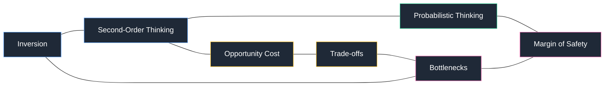

# Mental Models for Claude Code

[](https://github.com/cyperx84/claude-skills-mental-models/stargazers)
[](./LICENSE)
[](https://docs.claude.com/en/docs/claude-code)
[](./.github/CONTRIBUTING.md)

Turn Claude Code into a thinking partner with 98 Munger-style mental models bundled as a single skill.

> A latticework for better decisions, one prompt away.

<!-- Demo GIF placeholder — recording coming soon.

-->

## What It Does

Loads 98 cognitive frameworks into Claude Code as an auto-activating skill. Ask Claude to "apply inversion," "find the bottleneck," or "help me think through X" and it selects the right models, walks their Thinking Steps, and returns actionable insight.

## Why Munger?

Charlie Munger argued that worldly wisdom comes from building a **latticework of mental models** drawn from many disciplines—then hanging experience on that lattice. A single discipline gives you a hammer; a latticework gives you judgment. This skill operationalizes that idea: instead of one framework, Claude reaches across psychology, physics, economics, math, and strategy to analyze your problem. Read more in [Poor Charlie's Almanack](https://www.stripe.press/poor-charlies-almanack) or Farnam Street's [Mental Models hub](https://fs.blog/mental-models/).

## Quick Start

Install with copy:

```bash
git clone https://github.com/cyperx84/claude-skills-mental-models.git
cp -r claude-skills-mental-models/.claude/skills/mental-models ~/.claude/skills/
```

Or symlink (stays in sync with updates):

```bash
ln -s "$(pwd)/claude-skills-mental-models/.claude/skills/mental-models" ~/.claude/skills/mental-models
```

Then in Claude Code:

```
Apply inversion to my pricing strategy.
```

The skill auto-activates on phrases like *help me think*, *apply mental model*, or any model name (inversion, bottlenecks, second-order thinking, margin of safety...).

## Usage Examples

```
Apply inversion to this architecture decision
```

```
What mental models help with scaling systems?
```

```
Help me think through whether to take this job offer
```

## Browse All 98 Models

Full catalog in [docs/categories.md](./docs/categories.md).

| Category | Range | Sample |
|---|---|---|
| General Thinking | m01–m09 | First principles, inversion, second-order thinking |
| Science | m10–m29 | Leverage, inertia, feedback loops |
| Systems Thinking | m30–m40 | Bottlenecks, scale, margin of safety |
| Mathematics | m41–m47 | Randomness, regression to the mean |
| Economics | m48–m59 | Trade-offs, scarcity, creative destruction |
| Art | m60–m70 | Framing, audience, contrast |
| Strategy | m71–m75 | Asymmetric warfare, seeing the front |
| Human Nature | m76–m98 | Cognitive biases, incentives, social proof |

## The Latticework in Action



One problem, many lenses—that's the point.

## Contributing

Model additions, fixes, and new examples welcome. See [CONTRIBUTING.md](./.github/CONTRIBUTING.md).

## License

[MIT](./LICENSE)

## References

Sources, citations, and further reading in [REFERENCES.md](./REFERENCES.md).
