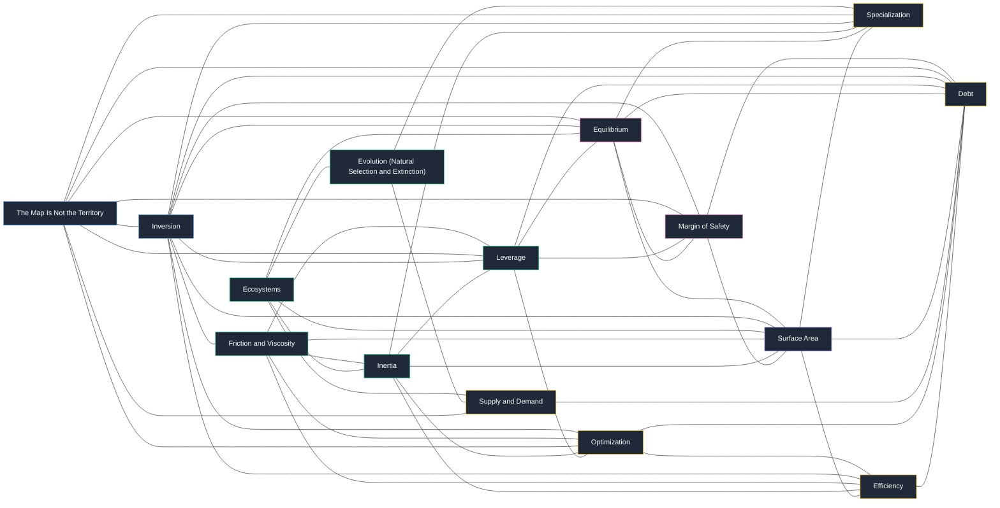

# Mental Models for Claude Code

[](https://github.com/cyperx84/claude-skills-mental-models/stargazers)
[](./LICENSE)
[](https://docs.claude.com/en/docs/claude-code)
[](./.github/CONTRIBUTING.md)

Turn Claude Code into a thinking partner with 98 Munger-style mental models bundled as a single skill.

> A latticework for better decisions, one prompt away.


## What It Does

98 Munger-style mental models, hand-written with Thinking Steps, Coaching Questions,
and a **When to Avoid** section each — packaged as a skill. Ask for "inversion,"
"find the bottleneck," or "help me think through X" and Claude picks the right models,
walks their Thinking Steps, and returns actionable insight.

## Install

> **Status note (2026-08):** the skill is the working install path and always has been.
> The CLI, MCP server, and Python library in `packages/` have **never been published to
> PyPI** — the `mental-models` name on PyPI belongs to an unrelated 2020 project, so the
> `pip install mental-models` instructions previously listed here did not install this
> software. They are removed below rather than left standing. The package ships as
> `mental-models-kit` in the next release; until then, use the skill.

| Interface | Install | Use |
|---|---|---|
| **Claude Code skill** *(primary — works today)* | symlink/copy `.claude/skills/mental-models/` to `~/.claude/skills/` | auto-activates on trigger phrases |
| **Portable skill** for OpenClaw & AgentSkills harnesses | symlink/copy `skills/mental-models/` into the harness's skills dir | same content |
| **CLI / Python library** | *not yet published* — clone and `uv run` from `packages/mental_models/` | `mental-models select "..."` |
| **MCP server** | *not yet published* | — |

The skill reads the 98 model files directly and needs no install beyond the symlink.

## Why Munger?

Charlie Munger argued that worldly wisdom comes from building a **latticework of mental models** drawn from many disciplines—then hanging experience on that lattice. A single discipline gives you a hammer; a latticework gives you judgment. This skill operationalizes that idea: instead of one framework, Claude reaches across psychology, physics, economics, math, and strategy to analyze your problem. Read more in [Poor Charlie's Almanack](https://www.stripe.press/poor-charlies-almanack) or Farnam Street's [Mental Models hub](https://fs.blog/mental-models/).

## Quick Start

**Claude Code skill** — symlink (stays in sync) or copy:

```bash
git clone https://github.com/cyperx84/claude-skills-mental-models.git
ln -s "$(pwd)/claude-skills-mental-models/.claude/skills/mental-models" ~/.claude/skills/mental-models
```

Then in Claude Code: *"Apply inversion to my pricing strategy."* The skill auto-activates on phrases like *help me think*, *apply mental model*, or any model name (inversion, bottlenecks, second-order thinking, margin of safety...).

**Portable skill for OpenClaw & other AgentSkills harnesses:**

```bash
# drop into your harness workspace
ln -s "$(pwd)/claude-skills-mental-models/skills/mental-models" <workspace>/skills/mental-models
```

Details and per-harness instructions: [`docs/openclaw/README.md`](./docs/openclaw/README.md).

**CLI, Python library, MCP server** — source is in [`packages/`](./packages/) but none of it
is published yet (see the status note above). Run from a clone if you want to try it:

```bash
git clone https://github.com/cyperx84/claude-skills-mental-models.git
cd claude-skills-mental-models/packages/mental_models
uv run mental-models select "how do I decide between two jobs" -k 5
```

## Usage Examples

```
Apply inversion to this architecture decision
```

```
What mental models help with scaling systems?
```

```
Help me think through whether to take this job offer
```

## Browse All 98 Models

Full catalog in [docs/categories.md](./docs/categories.md).

| Category | Range | Sample |
|---|---|---|
| General Thinking | m01–m09 | First principles, inversion, second-order thinking |
| Science | m10–m29 | Leverage, inertia, feedback loops |
| Systems Thinking | m30–m40 | Bottlenecks, scale, margin of safety |
| Mathematics | m41–m47 | Randomness, regression to the mean |
| Economics | m48–m59 | Trade-offs, scarcity, creative destruction |
| Art | m60–m70 | Framing, audience, contrast |
| Strategy | m71–m75 | Asymmetric warfare, seeing the front |
| Human Nature | m76–m98 | Cognitive biases, incentives, social proof |

## The Latticework in Action



<details><summary>Mermaid source</summary>



</details>

_Auto-generated from shared-keyword analysis. Full graph: [docs/latticework.json](./docs/latticework.json)._

One problem, many lenses—that's the point.

## Use Outside Claude Code

The portable skill at [`skills/mental-models/`](./skills/mental-models/) drops into OpenClaw
and any AgentSkills-convention harness.

Two unpublished sibling packages live in [`packages/`](./packages/) — a CLI/Python library
and an MCP server. Both work from a clone, neither is on PyPI yet:

```python
# from a clone, with packages/mental_models on your path
from mental_models import select_models, get_model

for m in select_models("how do I decide between two jobs", top_k=5):
    print(m.slug, "-", m.name)

print(get_model("inversion").description)
```

See [`packages/mental_models/README.md`](./packages/mental_models/README.md) for the full API.

## Contributing

Model additions, fixes, and new examples welcome. See [CONTRIBUTING.md](./.github/CONTRIBUTING.md).

## License

[MIT](./LICENSE)

## References

Sources, citations, and further reading in [REFERENCES.md](./REFERENCES.md).
